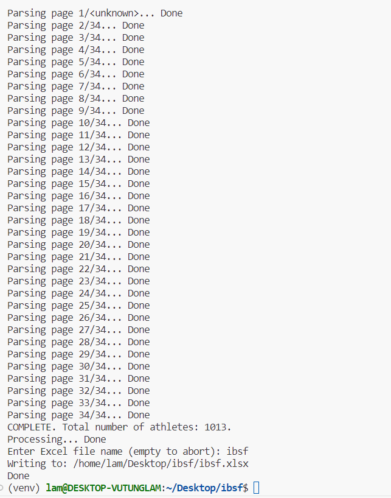
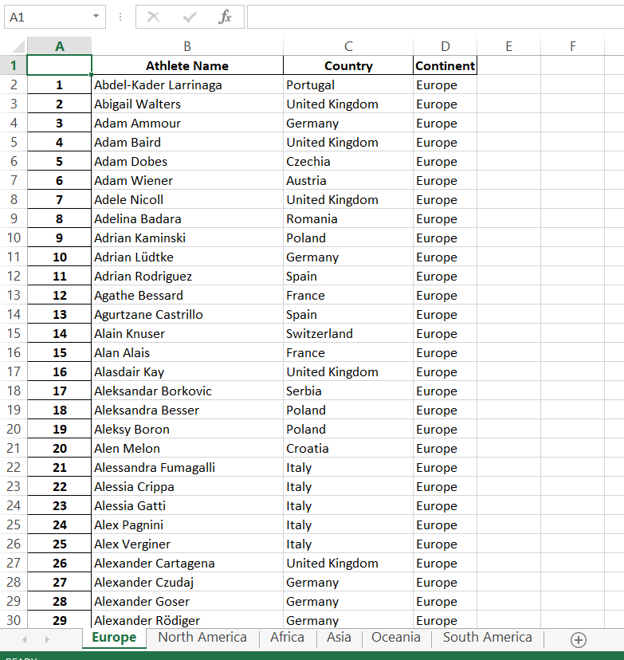

# IBSF Athletes Parser

- [IBSF Athletes Parser](#ibsf-athletes-parser)
  - [What is this?](#what-is-this)
  - [Setup](#setup)
  - [Run](#run)
  - [Implementation Details](#implementation-details)

## What is this?

This Python script parses the following web page:

<https://www.ibsf.org/en/athletes?tx_fmathletes_list%5Bgender%5D=&tx_fmathletes_list%5Bnation%5D=&tx_fmathletes_list%5Bpage%5D=4&tx_fmathletes_list%5Bseason%5D=1000004&tx_fmathletes_list%5Bsport%5D=&tx_fmathletes_list%5Bsword%5D=&cHash=cb25b00d994506582e714c8769e07c57>

to enumerate all the athletes, as well as their
countries and continents.

All the parsed data goes to an Excel file whose
file name is to be specified by the user.





## Setup

0. Clone/download this repository.

1. Make sure Python and pip is installed.

   ```sh
   python -V
   pip -V
   ```

2. Create a Python virtual environment,
   if you want (please name the directory
   `venv` so that it could be `gitignore`'d).

3. Inside the project's directory, enter the
   following command:

   ```sh
   pip install -r requirements.txt
   ```

## Run

Still inside the project's directory:

```sh
python ibsf.py
```

## Implementation Details

I did not implement asynchronous webpage
fetching because that might results in
a 503 Forbidden or 429 Rate Limited
response.

As a result, the script could take up to
5 minutes to parse all roughly 34 pages
with over 1000 athlete entries (Most of
that time is networking time).
